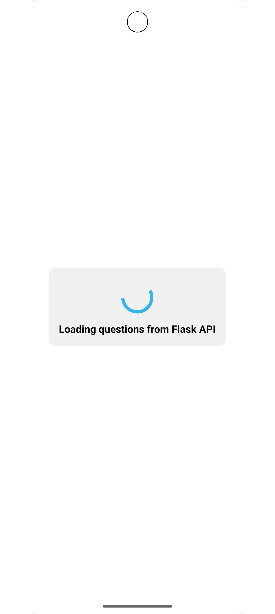
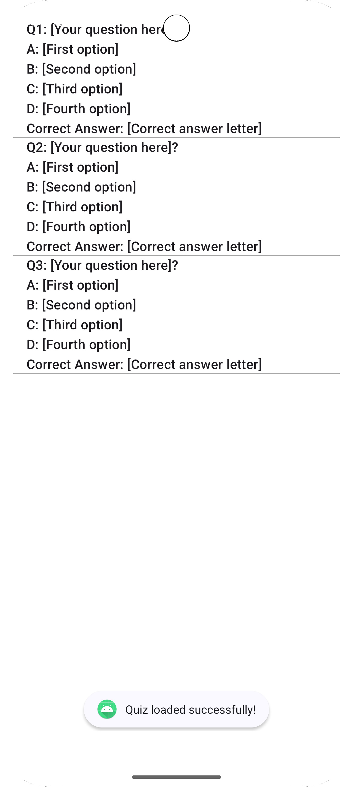

# Running the code:
1. First run the backend code.
2. Clone the repo to Andriod Studio
3. Let all files/gradle setup finish.
4. Run as normal android app.

# Note: 
If you are using different port than 5000 in backend, then change it to different port in the code as well.

# Output:

